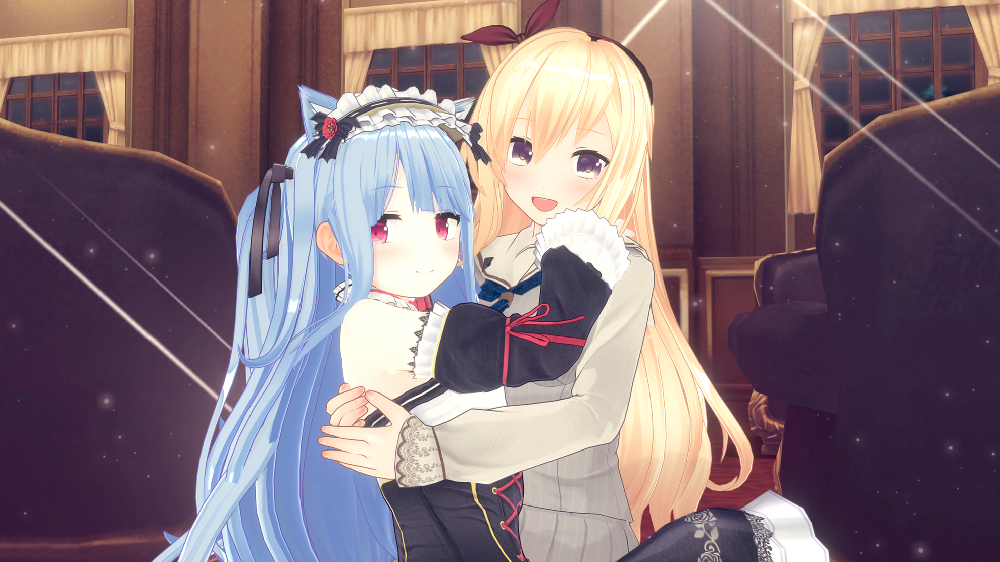
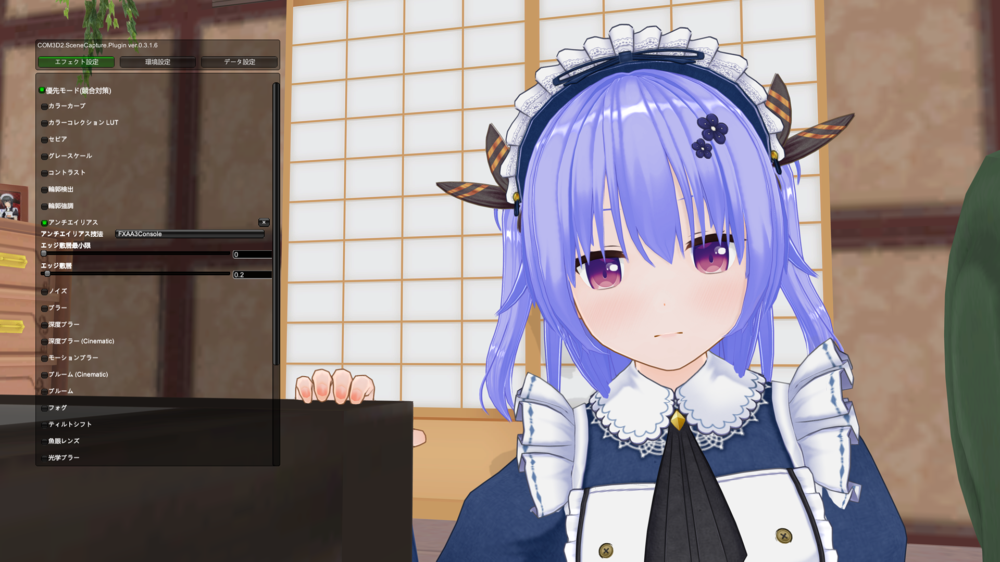
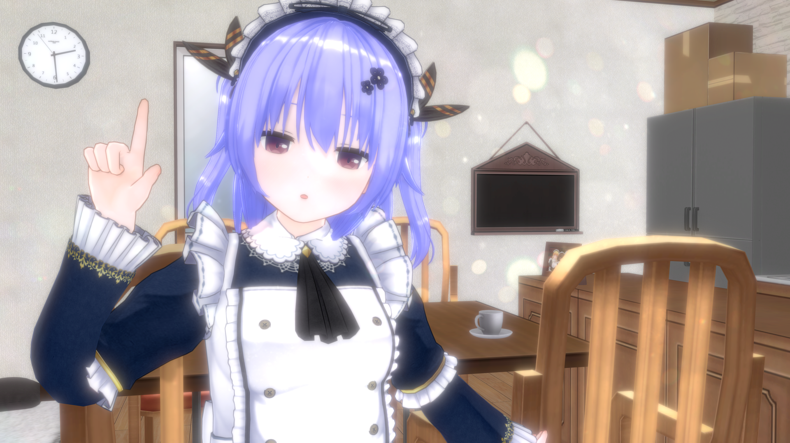
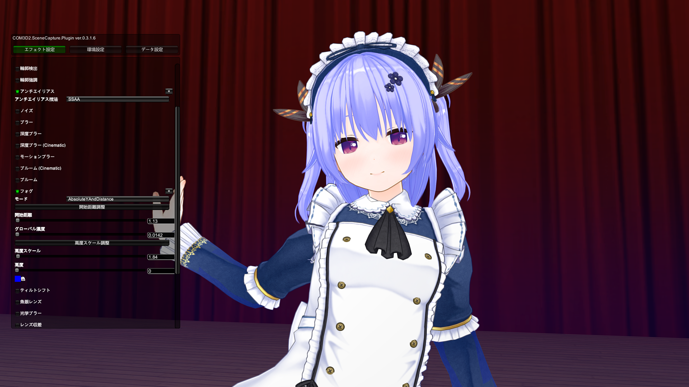
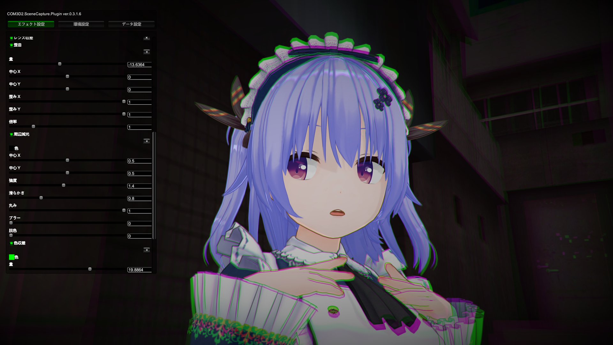
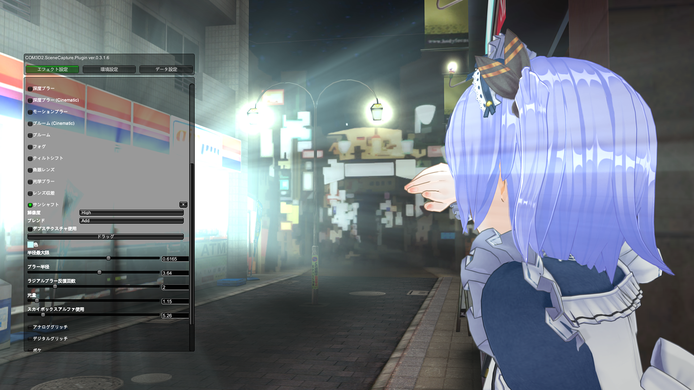
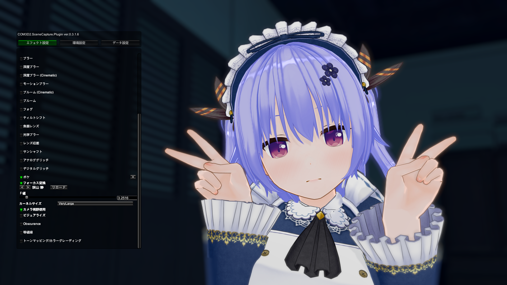
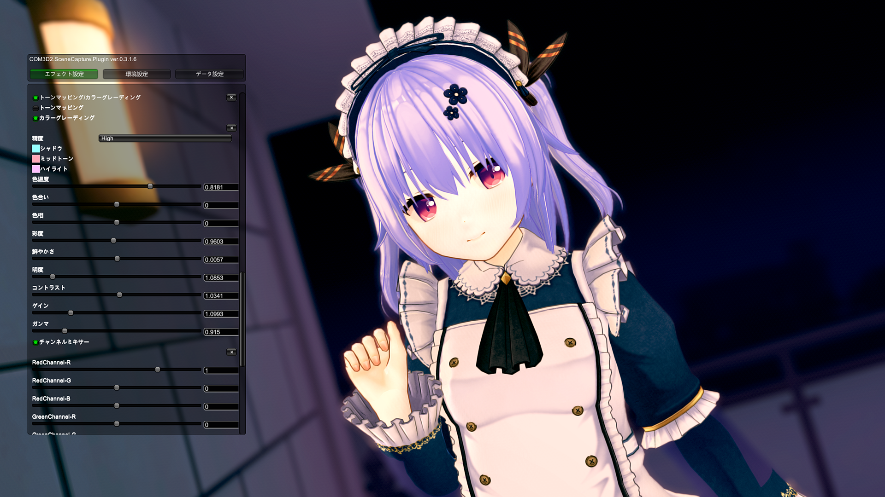
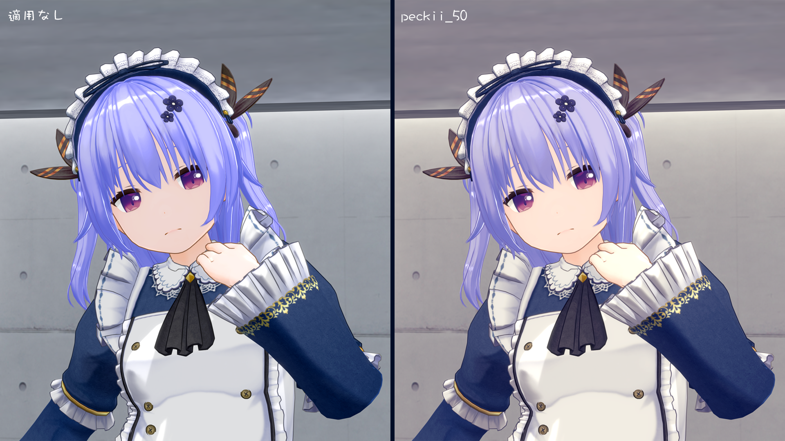
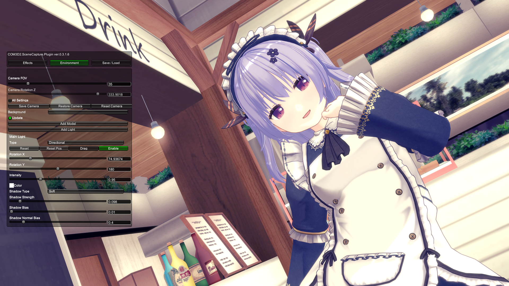

※この記事は [mstdn.maud .io Advent Calendar 2018](https://adventar.org/calendars/2892)  11日目の記事です。

クリスマスケーキ予約してません。８号です。

:don:、通称末代鯖。ここで流行っている、手を出してしまったオタクが現実に帰ってこられなくなるコンテンツと言えば……そう、カスタムメイド3D2、あるいはカスタムオーダーメイド3D2です。最近ではカスタムキャストというスマートフォンアプリも配信され、端末片手にうちの子を作る方も爆発的に増えていってます。いいですね。

# 今回の趣旨

SS（スクリーンショット）、撮ってますか。

エンパイアクラブを経営する方誰しもが嫁、うちの子を持っているはずです。せっかくなので、SceneCaptureプラグインを使ってSSを彩り、メモリアルな1枚を作ってみませんか？

# SceneCapturePluginとは

CM3D2・COM3D2上で各種エフェクトや色調の補正ができるプラグイン。

このプラグインでできることはかなり多く、特に、LUTの適用、カラーグレーディングをはじめとした充実した補正機能はまるでゲーム上でAdobe Photoshop Lightroomを扱っているかのよう。（ほんまか？）公式撮影モードや複数メイド撮影をはじめ、あらゆる場面で利用できます。

CM3D2版は[ShinHogera氏によってリリース](https://github.com/ShinHogera/CM3D2.SceneCapture.Plugin)、COM3D2版はしきしま氏などによって、CM3D2版になかったような機能を引っ提げてリリースしています。つよい。

今回の記事では、ぼくがよく使うエフェクトをかいつまんで説明していきたいと思います。

# 最新版（COM3D2）

<blockquote class="twitter-tweet" data-lang="ja">
オダメ版 SceneCaptureプラグイン v0.3.1.6を公開しました。  ・レンズ収差(Lens Aberrations)のエフェクトを追加  ・エフェクトウィンドウに優先モード(Update)ボタンを追加  ・スクロール動作を修正<a href="https://twitter.com/hashtag/COM3D2?src=hash&amp;ref_src=twsrc%5Etfw">#COM3D2</a> <a href="https://twitter.com/hashtag/%E3%82%AB%E3%82%B9%E3%82%BF%E3%83%A0%E3%82%AA%E3%83%BC%E3%83%80%E3%83%BC%E3%83%A1%E3%82%A4%E3%83%893D2?src=hash&amp;ref_src=twsrc%5Etfw">#カスタムオーダーメイド3D2</a><a href="https://t.co/9fZKnF9qeR">https://t.co/9fZKnF9qeR</a> <a href="https://t.co/WFMqJx8eOh">pic.twitter.com/WFMqJx8eOh</a>
&mdash; しきしま@新垢 (@sixima_punipuni) <a href="https://twitter.com/sixima_punipuni/status/1070655826648428544?ref_src=twsrc%5Etfw">2018年12月6日</a></blockquote>

# よく使うエフェクト

## アンチエイリアス

コンフィグの項目にもアンチエイリアスがありますが、これをかけた状態で更にアンチエイリアシングが可能です。なんだそれ。

ここで使える技法はFXAA（FXAA1～3）、NFAA、SSAA、DLAAの4種類です。

画質的に一番良いのはSSAAらしいですが、どの技法もめっちゃ細かいところで差異が出るレベルなので、好きなのを選ぶのが良いでしょう。ぼくは大抵FXAA2を使っています。
    
## ブルーム (Cinematic)

公式撮影モードなどのブルームとは違ったクセのある、めっちゃ発光するタイプのブルームです。雰囲気的には[こんな感じ](http://tsubakit1.hateblo.jp/entry/2016/05/20/073000)だと思われる。（というかCinematic Image Effectsをそのまま利用している……？）

敷居が記事でいうところのThreshold、半径がRadius、強度がIntensity、といった感じでしょうか。

一番下にdirtTexturePickerという項目があり、これで画像を指定してdirtIntensityの値を調整すると、ブルームがかかっているところに当該画像がマスキングされます。煌びやかで割といい感じになるかもしれません。

## フォグ

公式撮影でもおなじみの、霧をかけるようなエフェクト。とりあえず下から生やしておけばムードを作ることができるスグレモノです。

SceneCaptureでは4つのモードを選ぶことができます。AbsoluteYAndDistanceというのが公式撮影でもお馴染みのフォグです。開始距離調整と高度スケール調整は本来ならギズモが出てくるはずなんですがうまく機能していないみたいです。残念……

## レンズ収差

収差とは、色のにじみやずれが生じ、画質が劣化する現象を指します。撮影した写真においては深刻な現象ですが、SSでは意図的に発生させて怖そうな雰囲気を出したりすることができます。えっちなことにも使えます。

周辺減光だけ利用するということも可能で、これこそえっちなことに使えます。収差ってえっちなエフェクトだったんだなあ。

## サンシャフト

放射状の光を出します。眩しさを表現する時にめっちゃ使えます。

ドラッグをクリックするとギズモが出てきて、それで放射位置の調整ができます。光の色も指定できるので、神々しい雰囲気も出せそうです。

## ボケ

焦点の範囲外に生みだされたボヤけた領域を意図的に利用する表現手法、すなわちBokehです。実質深度ブラーですが、メイドさんをフォーカスに指定できるので深度ブラーよりもお手軽にBokehさせることができて重宝します。

## トーンマッピング/カラーグレーディング

このプラグインの肝と言っても過言ではないエフェクトです。

映像の雰囲気を決めるための色調整作業を主にカラーグレーディングと呼びます。トーンマッピングは簡単に言うと全体の明るさを上げたり下げたりして全体の見た目を整えるやつです。音楽で言うマスタリングみたいな感じ。（ほんまか？）

カラーグレーディングについては、[こちらの動画](https://www.youtube.com/watch?v=98KmTt-aFEc)が参考になるかと思います。

調整項目はかなり充実していて、シャドウ・ミッドトーン・ハイライトに色を振ったり、トーンカーブを調整してコントラストをはっきりさせたりはもちろん、カラーチャンネルの調整などもあります。正直なところぼくも全部把握しきれていません。沼に浸かりそうなくらい怖い項目群ですが、狙った雰囲気が出せること間違いなしなので覚えておいて損はありません。

## カラーコレクションLUT

LUT(ルックアップテーブル)を使用して、お手軽に色調を補正するエフェクトです。カラーグレーディングが苦手でも、簡単に雰囲気が出せるのがいいですね。
LUTのプリセットはカス侍氏やヘルミ氏などが公開しているほか、フォトショなどがあればSceneCaptureプラグインに付属のNeutralLUTに色調補正レイヤーをかけたりして、オリジナルのLUTを作ることも可能です。

## カメラ回転Z

これはエフェクトじゃないんですが、カメラをZ軸回転させることができます。上のSSのように斜めに傾いたSSが撮れます。インスタ映えを狙えますね。

値を90あるいは270にすれば縦向きのSSも作れます。メイドさんの全体像を撮りたいぞって時に地味に便利です。

# おわりに

いかがでしたでしょうか。皆さんも是非SceneCaptureプラグインでSSを彩り、うちの子を輝かせてあげてください。というか魅力的なSSが見たい！見せてくれ！

余談ですが、SS撮影用途以外にも、ダンス鑑賞モードでもSceneCaptureプラグインが使えます。エフェクトのプリセットを読み込んで、好みのエフェクトでダンスが鑑賞できます。現代社会に疲れたら、こちらも是非試してみてください。（ボケを適用しているとメイドさんがアップになった時にめっちゃぼやけることがありますが……）

ありがとうございました。明日はエセ賢者さんです。